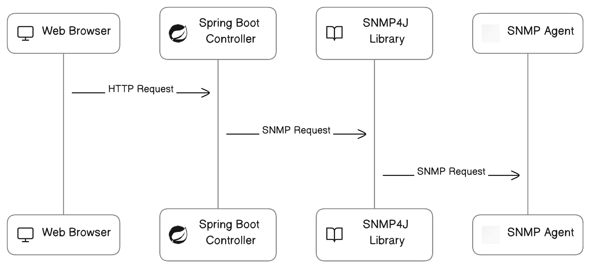
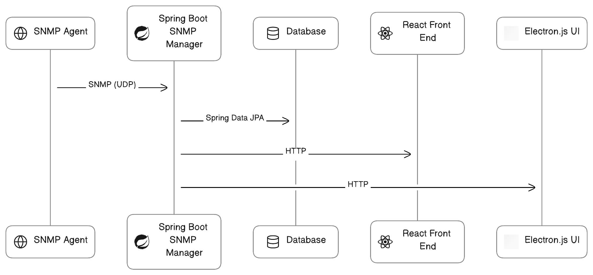
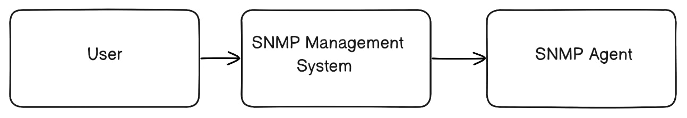
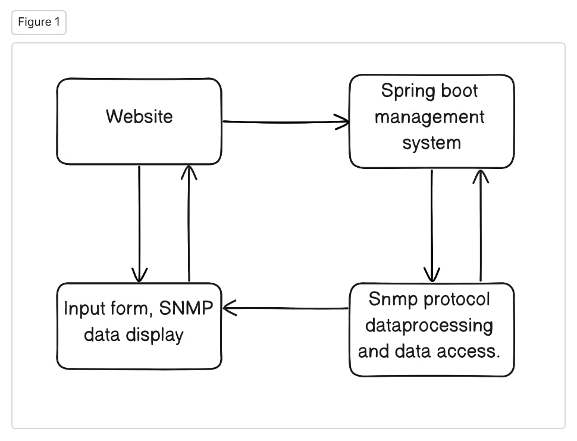
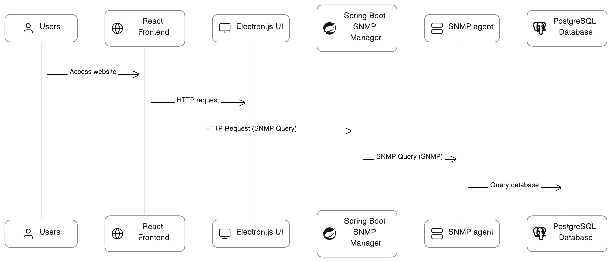

Conceptual Idea of building 'SNMP agent and manager application'.
=================================================================

**Overview**

This project involves building a Simple Network Management Protocol, including a Spring Boot backend, a React frontend, and an Electron.js desktop app. We start by creating a Spring Boot application that acts as an SNMP Agent and Manager. The Agent responds to network management requests, while the Manager handles communication with the frontend. We also set up a database to store SNMP data. The React frontend lets users input requests, and an Electron.js app provides a desktop interface. We test the system using Postman and ensure smooth communication between components. SNMP data is stored in the database.

           

                      
**Methodology or Approach**

The methodology commences with the development of a Spring Boot application configured as an SNMP Simple Network Management Protocol Agent. This Agent is primed to accept SNMP queries, process them, and furnish responses, effectively acting as a network management system. Additionally, it possesses the capability to persistently store SNMP data in a designated database.

Simultaneously, a relational database system, such as MySQL or PostgreSQL, is integrated into the architecture. This database serves as a repository for storing SNMP data collected by the Agent.

Subsequently, two distinct user interfaces are constructed: a web-based React frontend and an Electron.js-powered desktop UI. These interfaces provide user-friendly access to the SNMP system, facilitating the input of SNMP queries and presenting SNMP data responses retrieved from the Agent.

To validate the functionality of the system, comprehensive testing is conducted using Postman, a versatile API testing tool. This testing ensures that SNMP queries generate accurate responses and that data persistence in the database functions as intended.

Ultimately, the deployment phase involves hosting the Spring Boot application as a web service while packaging and distributing the React frontend as a web application. The Electron.js UI is packaged and distributed as a cross-platform desktop application. This methodical approach combines the capabilities of Spring Boot, React, Electron.js, and SNMP to construct a robust SNMP management solution.        

Architecture according to C4 model
----------------------------------

**System Context Diagram Level 1:**

           
* User represents the end-user who interact with the SNMP management system through the React frontend and Electron.js.

* SNMP management system that includes the spring boot SNMP manager applications, the Database, the React Frontend, and the Electron.js.
           

* SNMP agent represents the SNMP agents that collect data from network devices.

**Container Diagram Level 2:**

.. image:: 4pro.jpg
          :width: 600
          :alt: Alternative text
          
* The web-based interface accessed through a web browser. Users input SNMP queries and view SNMP data.  
        

* Spring boot SNMP manager system the backend application responsible for interacting with SNMP agents, processing SNMP queries, and handling data storage in the database.

**Component Diagram Level 3:**

          
* Website components within the React frontend, including an input form for SNMP queries and components to display SNMP data, responsible for communication with the Spring Boot SNMP Manager application.          

* Spring boot SNMP manager system components within the Spring boot application, including SNMP protocol handling, data processing, and database access.

**Dynamic diagram Level 4 - interaction:**

          
* Data flows from the Users who interact with either the React frontend or the Electron.js.

* Users initiate HTTP requests carrying SNMP queries to either the React frontend or the Electron.js.

* These HTTP requests are forwarded to the Spring Boot SNMP Manager applications.

* The SNMP manager applications process SNMP queries, communicate with SNMP agents using SNMP protocol, and fetch data from the Database.

* Finally, the SNMP manager applications send back HTTP responses with the requested SNMP data to UI components, which display the data to users.

Implementation
--------------

**Spring Boot**

Step1:
------
 
**Create Maven project**

* You can create a Maven-based Spring Boot project using the Spring Initializer web tool (https://start.spring.io/) or by using your favorite integrated development environment (IDE) like Eclipse or IntelliJ IDEA.

Step2:
------

**Configure Maven Dependencies**

* Once you have your project set up, open the pom.xml file and add the required dependencies below are the references.

:: 
  
    <dependencies>
    <!-- Spring Boot Starter Dependencies -->
    <dependency>
    <groupId>org.springframework.boot</groupId>
    <artifactId>spring-boot-starter-web</artifactId>
    </dependency>
    <dependency>
    <groupId>org.springframework.boot</groupId>
    <artifactId>spring-boot-starter-data-jpa</artifactId>
    </dependency>
    <!-- PostgreSQL Database Driver -->
    <dependency>
    <groupId>org.postgresql</groupId>
    <artifactId>postgresql</artifactId>
    </dependency>
    <!-- Spring DevTools -->
    <dependency>
    <groupId>org.springframework.boot</groupId>
    <artifactId>spring-boot-devtools</artifactId>
    <scope>runtime</scope>
    </dependency>
    <!-- SNMP4J Agent and Manager Libraries -->
    <dependency>
    <groupId>org.snmp4j</groupId>
    <artifactId>snmp4j-agent</artifactId>
    <version>2.7.0</version>
    </dependency>
    <dependency>
    <groupId>org.snmp4j</groupId>
    <artifactId>snmp4j</artifactId>
    <version>3.5.1</version>
    </dependency>
    </dependencies>
       
* Dont forget to adjust the versions of SNMP4J and PostgreSQL driver according to your project requirements.

Step 3: 
-------

**Add configuration to application Properties**

* Add configurations in application property. You can find application property file easily by looking in to the below given folder structure.
 

:: 
   
   - your-project-name/this is your root folder
   
   ├─ .mvn/
   
   ├─ .vscode/
   
   ├─ src/
   
   │   ├─ main/
   
   │   │   ├─ java/
   
   │   │   ├─ resources/
    
   │   │   │   ├─ static/
   
   │   │   │   ├─ templates/
   
   │   │   │   └─ application.properties
   
   │   ├─ test/ 
   
   ├─ target/ 
   
   ├─ .gitignore 
   
   ├─ HELP.md 
   
   ├─ java_pid222897.hprof 
   
   ├─ mvnw 
   
   ├─ mvnw.cmd 
   
   └─ pom.xml 

* Here are some general configurations listed below.

::

   spring.jpa.hibernate.ddl-auto=update
   spring.datasource.url=jdbc:postgresql://localhost:5432/(your database name)
   spring.datasource.username=postgres
   spring.datasource.password=root
   spring.datasource.driver-class-name=org.postgresql.Driver
   server.port=5151(enter your port number as you wish)
   # server.address=192.168.21.198    
   
Step4:
------

**Write code for controller**
 
* Create controller folder under src and add (.java) file in it.Reffer below package structure to have an idea.   
 
 
::
  
   - src/
   
   ├─ main/
   
   │   ├─ java/
   
   │   │   ├─ com/
   
   │   │   │   ├─ artifact_id/
   
   │   │   │   │   └─ your_project_name/
   
   │   │   │   │       ├─ controller/
   
   │   │   │   │       │   └─Controller.java

* In controller create multiple restApi's and multiple methods which will communicate with frontend operations.

* Here is the refference code snippets with explanation.

::

   @RestController
   @CrossOrigin("http://localhost:3000")
   public class SpringController {
   @Autowired
   public SpringRepo springrepo; 

* Here in above i have used @Restcontroller annotation.In short i will try to explain you what restcontroller does.Mainly restcontroller is used to make java class as controller class,which also handels HTTP requests and returns responses.The method inside this controller class will returns data to client.

* @CrossOrigin(provode your web page url),is used in web applications mainly in Javascript, React.js. It allows web page from one domain to make request to diffrent domain's servers.In simple allows communication between web page and a server located on a diffrent website.

* public class SpringController{, is the java class name and beginning of program.

* @Autowired, it is basically placed on any method which injects dependencies into method from other class.

* public SpringRepo springrepo; is interface which was called from repository class and is autowired.

::

   @PostMapping("/user")
   public SpringModel addNewuser(@RequestBody SpringModel springmodel) 
   {
   return springrepo.save(springmodel);
   }
   @GetMapping("/users")
   public List<SpringModel> getAllUser() 
   {
   return springrepo.findAll();
   }
   @GetMapping("/user/{id}")
   public Optional<SpringModel> getUserbyId(@PathVariable Long id) 
   {
   return springrepo.findById(id);
   }
   @PutMapping("/user/{id}")
   public Optional<Object> updateUser(@RequestBody SpringModel springmodels, @PathVariable Long id) 
   {
   return springrepo.findById(id).map(springmodel -> {
   springmodel.setAge(springmodels.getAge());
   springmodel.setAddress(springmodels.getAddress());
   springmodel.setName(springmodels.getName());
   return springrepo.save(springmodels);
   });
   }
   @DeleteMapping("/user/{id}")
   public String deleteUser(@PathVariable Long id) 
   {
   springrepo.deleteById(id);
   System.out.println("User with " + id + " has deleted successfully");
   return "User with " + id + " has deleted successfully";
   }
   }

* Here are some methods which performs perticular operations. AddNewuser() method brings data from client and save it in database with help of @Requestbody.

* @PostMapping is used for provideing unique url for the method.

* .save method comes from JPA crud repository interface which allows us to save data of entity to database.

*  GetAllUser() method is used to get the data of database.

* GetUserbyID() method is used to fetch user by id.

* UpdateUser() method is used to update the existing user.

* These all methods are provided by JPA crud repository.

Step5:
------

**Write code for Model**

* Create model folder under src and add (.java) file in it.Reffer below package structure to have an idea. 

:: 

   - src/
   
   ├─ main/
   
   │   ├─ java/
   
   │   │   ├─ com/
   
   │   │   │   ├─ artifact_id/
   
   │   │   │   │   └─ your_project_name/
   
   │   │   │   │       ├─ controller/
   
   │   │   │   │       │   └─Controller.java
   
   |   |   |   |       ├─ model/    
   
   |   |   |   |       |  └─Entity.java

* In an entity class, you should include the necessary attributes variables that represent the characteristics or properties of the entity you are modeling. These attributes should be private to encapsulate the data and maintain control over their access. To allow other parts of your program to interact with these attributes, you typically generate getter and setter methods for each attribute. These methods provide a way to retrieve get and modify set the attribute values. Below is the reference code snippets provided with explaination.
  
::

   @Entity
   public class SpringModel {
   @Id
   @GeneratedValue(strategy = GenerationType.SEQUENCE)
   private Long id;
   private String age;
   private String name;
   private String address;

   public Long getId() {
        return id;
   }

   public void setId(Long id) {
        this.id = id;
   }

   public String getAge() {
        return age;
   }

   public void setAge(String age) {
        this.age = age;
   }

   public String getName() {
        return name;
   }

   public void setName(String name) {
        this.name = name;
   }

   public String getAddress() {
        return address;
   }

   public void setAddress(String address) {
        this.address = address;
   }
   
* @Entity annotation represents that the name of the class will be the name of database,@Entity belongs to jakarta.persistence.Entity package.

* @Id annotation represents the primary key.On whichever variable we place @Id it will act as primary key.Id belongs to jakarta package.

* @GeneratedValue(strategy = GenerationType.SEQUENCE),this annotation need to be placed below id it will auto generate the id value instead of entering manually.It belongs to jakarta package.

* Below GeneratedValue,variables are declared, getters and setters methods are added  to read get and modify set attribute values.

::

   public SpringModel(Long id, String age, String name, String address) {
          this.id = id;
          this.age = age;
          this.name = name;
          this.address = address;
   }

* Above code snippet is of generating constructer for initializing the object properties.

::

   public SpringModel() {
        super();
    }    
         
* The above method is of generating default constructer to add instances of your entity with default values.

Step6:
------

**Write code for Repository**

* Create repository folder under src and add (.java) file in it.Reffer below package structure to have an idea. 

::
     
    - src/
   
    ├─ main/
   
    │   ├─ java/
   
    │   │   ├─ com/
   
    │   │   │   ├─ artifact_id/
   
    │   │   │   │   └─ your_project_name/
    
    │   │   │   │       ├─ controller/
   
    │   │   │   │       │   └─Controller.java
   
    |   |   |   |       ├─ model/    
   
    |   |   |   |       |  └─Entity.java
   
    |   |   |   |       ├─ repository/
 
    |   |   |   |       |  └─Repository.java 
   
   
* We make an interface where we define methods for basic database operations like saving, updating, deleting, and fetching data. 

* We extend this interface with CrudRepository or JpaRepository provided by Spring, which gives us ready-made methods to work with.

* We specify our data model class and the type of ID it uses as generic parameters when extending the repository interface. This tells Spring which data to manage.

* In our controller class, we use the @Autowired annotation to connect our repository. This way, we can easily use the pre-defined database operations in our controller methods.Below is the sample code provided for reference.

::

   public interface SpringRepo extends JpaRepository<SpringModel, Long> 
   {

   }
   
* By following above methods you can complete spring boot project for database operations.    
  
* Once the integration of the SNMP Agent and Manager is complete, the document will need further updates and enhancements to reflect this new functionality.   
   
