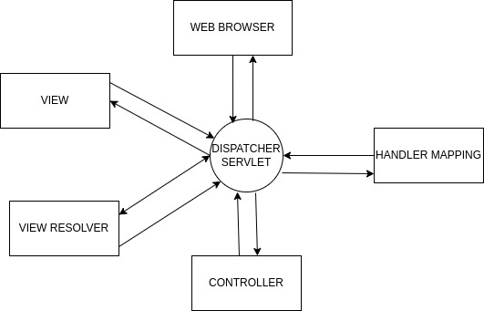

Conceptual Idea of building 'SNMP agent and manager application'.
=================================================================

* Preparing a conceptual documentation with a brief explanation from initial stage to end stage of the project and implementation plan.

Architecture
------------	

**SPRING MVC** 

          
* Spring is a framework of java 'MVC' stands for model, view, controller.Mainly we use of spring framework for loose coupling. 

**Model**

* The "model" in Spring MVC refers to the part of the application that manages data and business logic. It helps store and process information, making it available for the user interface.I think of it as the brain of a web app, handling data and operations behind the scenes to deliver a seamless user experience.

**View**

* In Spring MVC, the "view" is responsible for presenting data to users in a web application. It's like the visual part of a website, showing information and content to users in a user-friendly format. Views can be web pages, templates, or any interface element that displays data to users. Spring MVC helps connect the model and view to create dynamic and interactive web pages.

**Controller**

* In Spring MVC, the "controller" acts as a traffic cop for a web application. It receives user requests, processes them, and decides how to respond. Controllers handle the logic for interacting with the model and determine which view to show to the user. I think of them as the middlemen that manage the flow of information and actions in a web application, ensuring everything runs smoothly.

**IN the Beginning**

* I had created Spring boot application where, I had followed Spring MVC architecture.In Springboot project i had created multiple rest Api's in the controller class,which handels thymeleaf pages which is also known as multipage application.Multipage application means creating multiple html pages and coardinating the path of those pages with controllers.

* In the view class i had created multiple html-thymeleaf pages for diffrent-differnt operations to perform.

* In Model class i have created 3 entities.Basically i had performed crud operations in the project.Where i could add the student,fetch all the student,delete the student by id,update the student by id.

* Later insted of performing the operations in Gui i started testing our rest Api's by sending data in json format through Postma_Api.

.. image:: postman.jpg
          :width: 500
          :alt: Alternative text
          
* In Postman_Api i had checked all the operations like adding the user,fetching the user,deleting the user through get,delete,post method.

* Then i had written code for Snmp agent with the help of snmp4j library. In which i could check the response of agent to manager through wireshark,Later i had also written code for Snmp manager through snmp4j-agent library.Now i could get the data and set the data in my project through agent and manager code. 

.. image:: snmp.jpg
          :width: 500
          :alt: Alternative text
          
**Next task**

* Next task is i have to create react.js application for frontend,insted of thymeleaf i need to connect my react application to spring boot project through crossorigin annotation or by learning some server configurations of react.Where i can set the data,fetch the data,update the data and delete the data.

* After completion of all these tasks we need to learn some concepts Electron.js which is framework to create desktop applications.In Electron.js i need to integrate whole code of spring boot and react.js and create one desktop application using electron.js.

**Overview of our project**

.. image:: final.jpg
           :width: 500
           :alt: Alternative text
        
          
