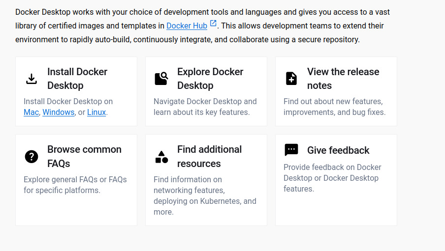
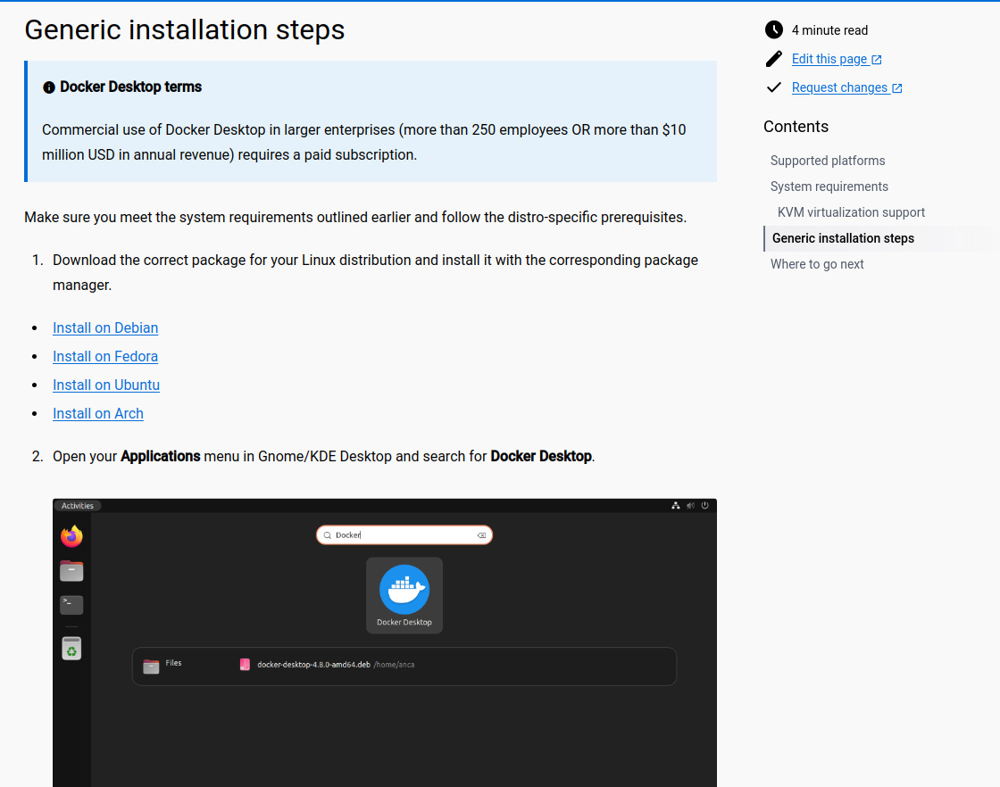
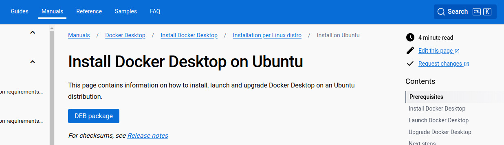
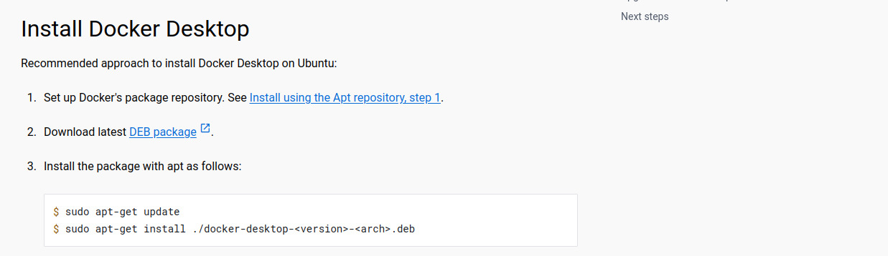

Documentation on the installation of Docker and hosting nginx documentation on the Docker container
===================================================================================================

* Go to the official documentation of docker by the below URL.

::
  
  https://docs.docker.com/desktop/?_gl=1*12tozlq*_ga*MjA2MDQzODE2OC4xNjk2ODMwMDg2*_ga_XJWPQMJYHQ*MTY5NjkyMjU3NC42LjEuMTY5NjkyMjU5NC40MC4wLjA.
  
  
* Once you visit the documentation you will find the option to install docker desktop, choose your specified OS.
  

          

* As I wanted to install it on Linux I chose Linux, as soon as you choose Linux and click you will be redirected to the next page. In those pages just type some commands as mentioned below.

::

  modprobe kvm
  

* Check your processor and choose the appropriate one.
  
::
  
  modprobe kvm_intel  # Intel processors 

  modprobe kvm_amd    # AMD processors  
  

::
 
   lsmod | grep kvm
   kvm_amd               167936  0
   ccp                   126976  1 kvm_amd
   kvm                  1089536  1 kvm_amd
   irqbypass              16384  1 kvm
   
* Follow the command, and enter your system user name.

::
 
 sudo usermod -aG kvm your syatem user name

* Then in the "Generic installation steps" section, choose Ubuntu see the below image for your reference.

          

* You will be redirected to the next page, you will find one button named DEB package click on it and the package will be downloaded.

          

* Once it's downloaded type the below command.

::

  sudo apt-get update
  sudo apt-get install ./(your downloaded package name).deb
  

* Next in the "Install Docker Desktop" section click on Install using Apt repository, step 1.

           

* You will find the page named as "Install Docker Engine on Ubuntu", On that page follow the following commands one by one as mentioned below.

::

   sudo apt-get update
   sudo apt-get install ca-certificates curl gnupg
   sudo install -m 0755 -d /etc/apt/keyrings
   curl -fsSL https://download.docker.com/linux/ubuntu/gpg | sudo gpg --dearmor -o /etc/apt/keyrings/docker.gpg
   sudo chmod a+r /etc/apt/keyrings/docker.gpg
   

::

  echo \
  "deb [arch="$(dpkg --print-architecture)" signed-by=/etc/apt/keyrings/docker.gpg] https://download.docker.com/linux/ubuntu \
  "$(. /etc/os-release && echo "$VERSION_CODENAME")" stable" | \
  sudo tee /etc/apt/sources.list.d/docker.list > /dev/null
  

::

  sudo apt-get update
  

::

  sudo apt-get install docker-ce docker-ce-cli containerd.io docker-build-plugin docker-compose-plugin
  

::

  sudo docker run hello-world
  

* Now your docker will be installed in your local system check it by the below command.

::

  docker --version
  

::
  
   docker info 
   

* If you find a server error then click on the DockerDesktop application and open it, then once check 

::
  
   docker info 
  

* Now it will be working fine.                 

Steps to create Docker image and container, hosting nginx documentation.
---------------------------------------------------------------------------

* Step 1: Create a Dockerfile in the folder where the built html files are present.

* Step 2: Write some configurations in the Dockerfile as mentioned below.

::
 
  FROM nginx

  COPY . /usr/share/nginx/html

  EXPOSE 8080

  CMD ["nginx", "-g", "daemon off;"]

* Step 3: Then build the docker image with the below mentioned command.

::
 
  docker build -t (image name)

* Step 4: Next create the container with below mentioned command.

::
  
  docker run -d --name (container name) -p 7070:80 (image name) 

