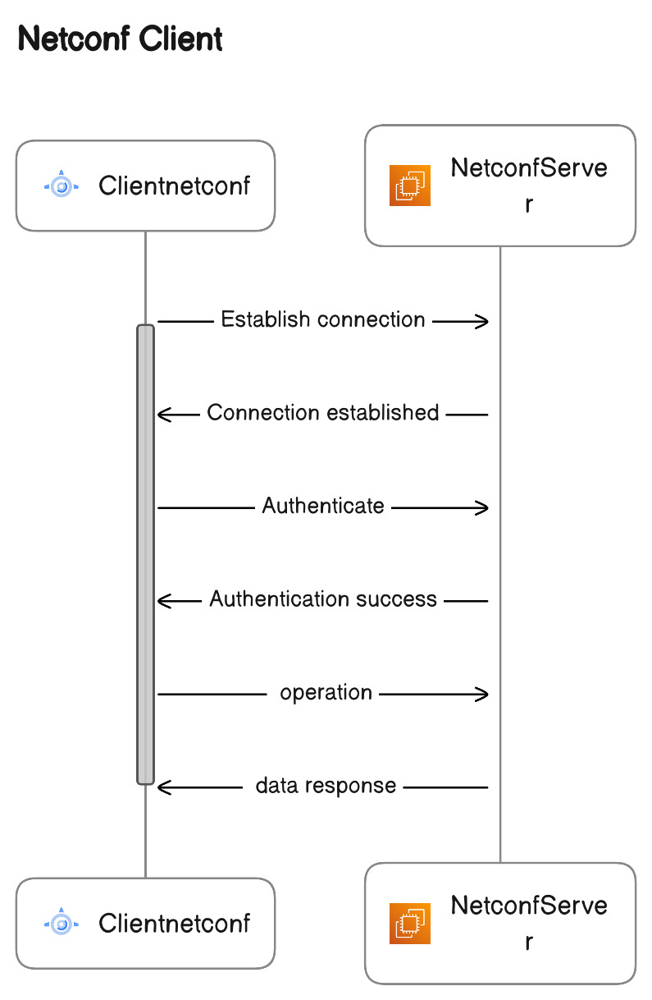

Building Netconf client application from scratch!!
=============================================================

**Overview**

The Netconf Server and Client applications are like two separate programs. The server uses Apache Mina to handle incoming connections from Netconf clients. It's responsible for checking if the clients are allowed to connect, and it understands the rules of the Netconf language.The client wants to talk to the server, so it uses Apache Mina to establish a connection. The client tells the server who they are and what they want using the Netconf. The server waits for clients to visit, checks if they are authentication, and listens to Netconf messages. The client, on the other hand, says hello, and asks for specific information using the Netconf, like requesting configuration details. The server and client communicate using Netconf, and Apache Mina helps them understand each other and manage their messages.

Process diagram
---------------

Implementation
--------------

**Spring Boot Client application**

Step1:
------
 
**Create Maven project**

* You can create a Maven-based Spring Boot project using the Spring Initializer web tool (https://start.spring.io/) or by using your favorite integrated development environment (IDE) like Eclipse or IntelliJ IDEA.

Step2:
------

**Configure Maven Dependencies**

* Once you have your project set up, open the pom.xml file and add the required dependencies below are the references.
 
 ::
      
     <dependency>
      <groupId>org.apache.mina</groupId>
      <artifactId>mina-core</artifactId>
      <version>2.1.3</version> 
     </dependency>

Step3:
------

**Write code for Client applicaion**
 
* Under src add (.java) file in it.Reffer below package structure to have an idea.   
 
 
::
  
   - src/
   
   ├─ main/
   
   │   ├─ java/
   
   │   │   ├─ com/
   
   │   │   │   ├─ artifact_id/
   
   │   │   │   │   └─ your_project_name/
   
   │   │   │   │        └─ClientNetconfApplication.java
   
   │   │   │   │        └─NetconfClientHandler.java

* Here is the refference code snippets 

::

      public class ClientnetconfApplication 
      {
       public static void main(String[] args) throws Exception 
	{
         SpringApplication.run(ClientnetconfApplication.class, args);
	 System.out.println(">>>>>>>>>>"+" Netconf client application started "+"<<<<<<<<<<");
	 String serverAddress = "192.168.21.151"; 
         int serverPort = 830; 
         IoConnector connector = new NioSocketConnector();
         connector.getFilterChain().addLast("codec", new ProtocolCodecFilter(new TextLineCodecFactory()));
         connector.setHandler(new NetconfClientHandler());

         // This is for Connecting to Netconf server
         ConnectFuture future = connector.connect(new InetSocketAddress(serverAddress, serverPort));
         future.awaitUninterruptibly();

         // Getting a session
         IoSession session = future.getSession();

         // Handle authentication and errors
         handleAuthentication(session);

         // Perform Netconf <get> operation
         performNetconfGetConfigOperation(session);
         Thread.sleep(5000);
         // Close the session and connector when done
         session.closeNow().awaitUninterruptibly();
         connector.dispose();
          }

          private static void handleAuthentication(IoSession session) 
          {
           try 
              {
               // Authenticate using username and password
               String username = "admin";//server user name 
               String password = "utl";//server password 
               String authenticationMessage = "<rpc message-id=\"2\" xmlns=\"urn:ietf:params:xml:ns:netconf:base:1.0\">\n" +
                                              "    <hello>\n" +
                                              "        <capabilities>\n" +
                                              "            <capability>urn:ietf:params:netconf:base:1.0</capability>\n" +
                                              "        </capabilities>\n" +
                                              "        <session-id>1</session-id>\n" +
                                              "        <username>" + username + "</username>\n" +
                                              "        <password>" + password + "</password>\n" +
                                              "    </hello>\n" +
                                              "</rpc>";

             session.write(authenticationMessage);
              }
               catch (Exception e) 
               {
                System.err.println("Authentication failed: " + e.getMessage());
                e.printStackTrace();
                session.closeNow();
                 }
                  }
                   private static void performNetconfGetConfigOperation(IoSession session) 
                   {
                    try
                     {
                      // Create a Netconf <get-config> operation
                      String getConfigOperation = "<rpc message-id=\"1\" xmlns=\"urn:ietf:params:xml:ns:netconf:base:1.0\">\n" +
                             "    <get-config>\n" +
                             "        <source>\n" +
                             "            <running/>\n" +
                             "               </source>\n" +
                             "                <filter>\n" +
                             "                 <person-details xmlns=\"urn:example:person-details\">\n" +
                             "                <name>Prajwal</name>\n" +
                             "                <age>23</age>\n" +
                             "                <address>Bangalore</address>\n" +
                             "            </person-details>\n" +
                             "        </filter>\n" +
                             "    </get-config>\n" +
                             "</rpc>";
    
                     // Log the Netconf operation before sending
                    System.out.println("Sending Netconf <get-config> operation:\n" + getConfigOperation);
    
                   // Send the Netconf <get-config> operation to the server
                   session.write(getConfigOperation);
                   }
                    catch (Exception e)
                     {
                      System.err.println("Failed to perform Netconf <get-config> operation: " + e.getMessage());
                      e.printStackTrace();
                      session.closeNow();
                      }
                       }
                        }
                        
                        
::

    public class NetconfClientHandler extends IoHandlerAdapter 
    {
    @Override
    public void sessionOpened(IoSession session) 
    {

    }
    @Override
    public void messageReceived(IoSession session, Object message) 
    {
     String receivedMessage = message.toString();
     System.out.println("Received message from server: " + receivedMessage);
     // Handle the received Netconf message here if required
     processNetconfResponse(receivedMessage);
    }
    private void processNetconfResponse(String netconfResponse) 
    {
    // Log the received Netconf response
     System.out.println("Processing Netconf response: " + netconfResponse);
    }
    @Override
    public void exceptionCaught(IoSession session, Throwable cause) 
    {
     System.err.println("Exception caught: " + cause.getMessage());
     cause.printStackTrace();
     session.closeNow();
    }    
    }
    
* Below is the refference output that you can check

    
::
  
   >>>>>>>>>> Netconf client application started <<<<<<<<<<
   Sending Netconf <get-config> operation:
   <rpc message-id="1" xmlns="urn:ietf:params:xml:ns:netconf:base:1.0">
    <get-config>
        <source>
            <running/>
               </source>
                <filter>
                 <person-details xmlns="urn:example:person-details">
                <name>Prajwal</name>
                <age>23</age>
                <address>Bangalore</address>
            </person-details>
        </filter>
    </get-config>
    </rpc>
   Received message from server: Welcome to the Netconf Server! You are connected.
   Processing Netconf response: Welcome to the Netconf Server! You are connected.    
   
   
* By following above methods you can complete spring boot project for netconf client operations. 
