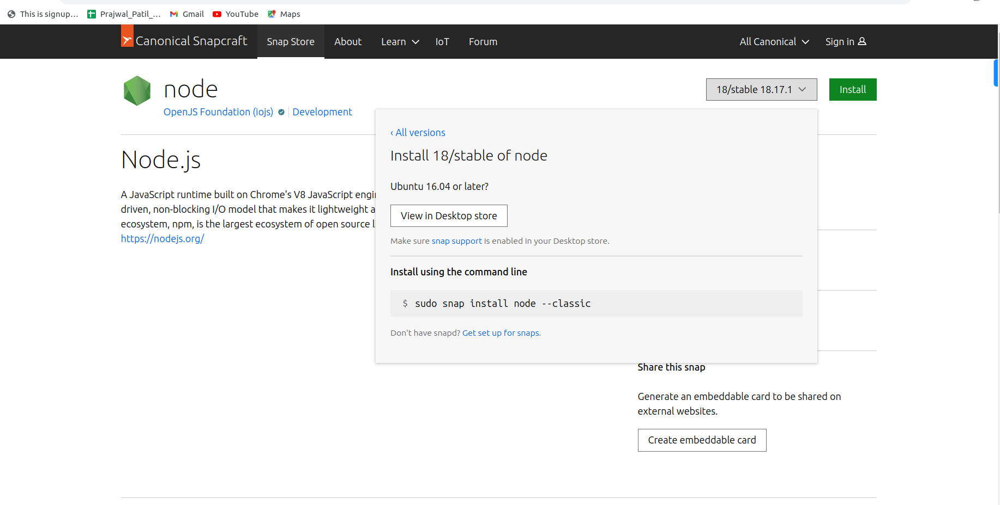
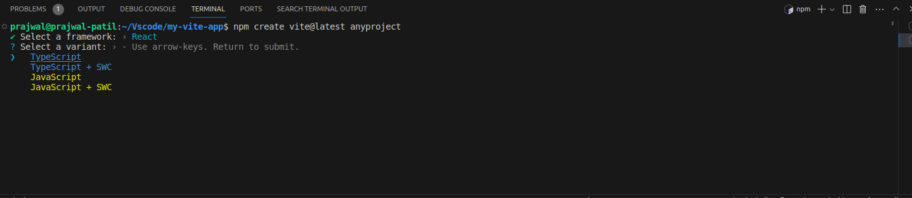
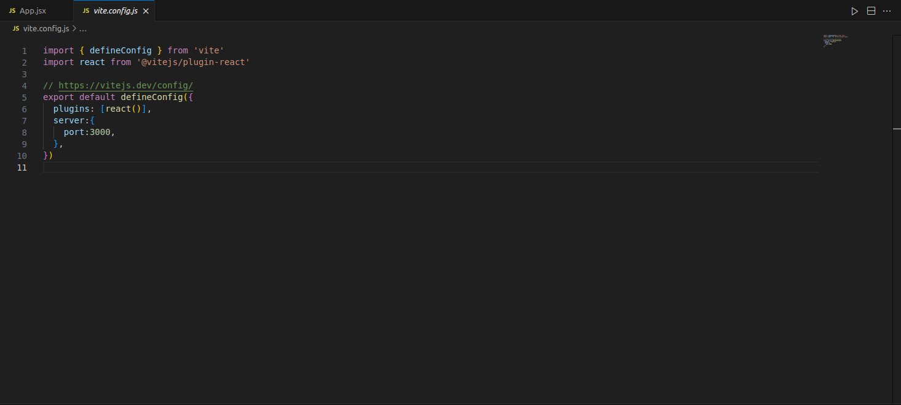

How to Setup React.js from scratch
==================================

* Download Visual studio for linux system.

* Open Visual studio code terminal, in terminal type node --version and check whether node is eisting or not.

* If Node.js is existing then check version of node.js, it should be greater than '12'.

* If Node.js is older version then remove the node.js from below command (use any one).

:: 

   sudo apt-get remove nodejs
   
   sudo npm uninstall -g npm
   
* To download latest version of node.js in your local system, go to google and search install node.js snap.

* Click on Snapcraft url.

::
  
   https://snapcraft.io/node
   
* In the website on right top you will find the dropdown,click on it and choose latest version.

* You will get command to install latest version of node.js. Copy the command to your visual studio terminal.

   
* Then your node.js will be installed.If you are not having node.js earlier in your system still you can follow the same steps.

* Now install Node package module with the below command.

:: 

   sudo apt install npm
   
   
* If version of npm is older update it through command provided below (use any one).

::
 
   npm update -g npm
  
   npm i -g npm

   npm install npm@latest -g   
   
* Now check version of npm it should be greater than '8'.Command to check npm version is given below.

::

   npm --version    
   
* Now install react application with below command.

::
  
   sudo npm install -g create-react-app     
   
* To check the version of react.js installed follow the command.

::
 
   create-react-app --version  
   
* Now create your first react project with below command.

::
 
   create-react-app <name of project>    
   
* You will get message in terminal as in below,then you are good to go and write your first react code in src.

::

   "Happy haking!"   
   
* After writing code you can compile and run your code with below command in terminal.

::

   npm start   
   
Creating React+Vite
-------------------

* To create React vite app you need to follow below procedures:

1.Go to visual studio terminal and type below command.

::
  
  npm create vite@latest (followed by your project name)
  
2.Then it will ask to select your framework it will provide list of options like as shown below.

.. image:: vite.jpg
   :width: 400
   :alt: Alternative text 
   
3.Select React,after selecting it will re-prompt you to select varient like as shown below.

   
4.Select Javascript in it then your project will be created,open your project folder in terminal as well as in visual studio code.Type below command to install node modules.

::

  npm install 
  
  
5.Now your project will be setup.To run the project type below command.

::
  
  npm run dev
  
6.By default it will be running on port localhost:5173,to change this port go to vite.config.js file and next to plugin add server port as shown below.

::
  
  plugins: [react()],
  server:{
  port:3000,
  },
     

   
7.Now clear everything from App.js and start writing your code.
